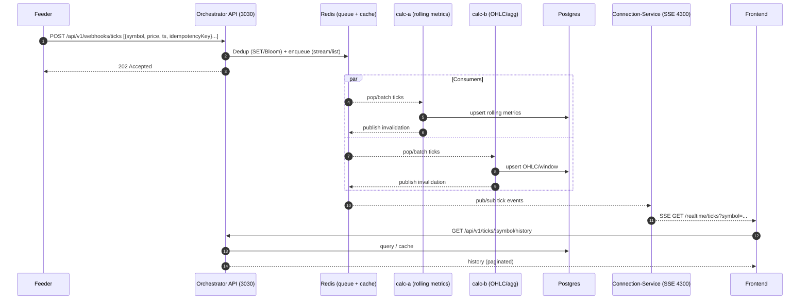

# API Specification — Orchestrator & Realtime

## 0. Conventions

- **Base URLs (local development):**
  - **Orchestrator API (HTTP):** `http://localhost:3030/api/v1`
  - **Connection-Service (SSE):** `http://localhost:4300/realtime`
- **Auth:** `Authorization: Bearer <token>` (v1 may accept `x-api-key`). *Note:* browsers cannot set `Authorization` on `EventSource`; pass a short-lived `token` via query or rely on cookie for SSE.
- **Content-Type:** `application/json; charset=utf-8`
- **Idempotency:** Webhooks accept `Idempotency-Key` (UUID) and per-item keys (see payload). Duplicates are ignored (202 Accepted).
- **Timestamps:** seconds since epoch (`number`) or ISO8601 (`string`). Server normalizes internally.
- **Pagination:** keyset via `?cursor=<opaque>&limit=...` where applicable.
- **Health & Metrics:** under `/health/*` and `/ops/metrics` (Prometheus text) **within `/api/v1`**.

---

## 1. Resources (HTTP — Orchestrator API, port 3030)

### 1.1 Symbols
- **GET `/symbols`** — List active symbols
  - **200:**
    ```json
    [
      { "symbol": "BTCUSDT", "base": "BTC", "quote": "USDT", "active": true },
      { "symbol": "ETHUSDT", "base": "ETH", "quote": "USDT", "active": true }
    ]
    ```

### 1.2 Ticks
- **GET `/ticks/:symbol`** — Latest tick
  - **200:**
    ```json
    { "symbol": "BTCUSDT", "price": 68234.12, "ts": 1730425220 }
    ```

- **GET `/ticks/:symbol/history?limit=1000&cursor=...`**
  - **Query:** `limit` (1..1000, default 200), `cursor` (opaque)
  - **200:**
    ```json
    {
      "items": [
        { "symbol": "BTCUSDT", "price": 68112.2, "ts": 1730425120 },
        { "symbol": "BTCUSDT", "price": 68120.9, "ts": 1730425180 }
      ],
      "nextCursor": "eyJzIjoiQlRDVVNEVCIsInQiOjE3MzA0MjUyMDB9"
    }
    ```

### 1.3 Aggregated Metrics
- **GET `/metrics/:symbol`**
  - **200:**
    ```json
    {
      "symbol": "BTCUSDT",
      "windowStart": 1730421600,
      "windowEnd": 1730425200,
      "count": 1242,
      "min": 67512.02,
      "max": 68320.55,
      "avg": 67910.14,
      "vwap": 67930.77,
      "volume": 152.41,
      "last": 68234.12
    }
    ```

### 1.4 Operational
- **GET `/health/liveness`** → `{"ok": true}`
- **GET `/health/readiness`** → `{"status":"ready","checks":{"db":"ok","redis":"ok"}}`
- **GET `/ops/metrics`** — Prometheus exposition format

> **Full URLs example:** `http://localhost:3030/api/v1/metrics/BTCUSDT`

---

## 2. Realtime (SSE — Connection-Service, port 4300)

- **GET** `/realtime/ticks?symbol=BTCUSDT[&token=JWT]`
  - **Headers:** `Accept: text/event-stream`
  - **Events:** `message` with JSON payload
    ```json
    { "symbol": "BTCUSDT", "price": 68234.12, "ts": 1730425220 }
    ```
  - **Keepalive:** `: ping\n\n` every ~15s
  - **Auth:** optional `token` query or cookie. *EventSource cannot set Authorization headers.*

> **Full URL example:** `http://localhost:4300/realtime/ticks?symbol=BTCUSDT`

---

## 3. Webhook Ingest (HTTP — Orchestrator API, port 3030)

Base: `POST http://localhost:3030/api/v1/webhooks/*`

### 3.1 Bulk Ticks
- **POST `/webhooks/ticks`**
  - **Body:**
    ```json
    {
      "source": "binance",
      "items": [
        {
          "idempotencyKey": "binance:BTCUSDT:1730425200",
          "symbol": "BTCUSDT",
          "price": 68234.12,
          "ts": 1730425200
        }
      ]
    }
    ```
  - **202:**
    ```json
    { "accepted": 1, "duplicates": 0, "queued": 1, "rejected": 0, "skipped": 0 }
    ```

### 3.2 Symbols upsert
- **POST `/webhooks/symbols`**
  - **Body:** `{ "items": [ { "symbol": "XAUUSD", "base": "XAU", "quote": "USD", "active": true } ] }`
  - **202:** `{ "upserted": 1, "skipped": 0 }`

---

## 4. Errors
```json
{ "error": { "code": "VALIDATION_ERROR", "message": "limit must be <= 1000" } }
```
Common: `AUTH_REQUIRED`, `PERMISSION_DENIED`, `VALIDATION_ERROR`, `RATE_LIMITED`, `INTERNAL_ERROR`.

---

## 5. Examples (curl)

```bash
# Orchestrator API (HTTP)
BASE_API=http://localhost:3030/api/v1

curl -s $BASE_API/symbols | jq
curl -s $BASE_API/ticks/BTCUSDT | jq
curl -s "$BASE_API/ticks/BTCUSDT/history?limit=50" | jq
curl -s $BASE_API/metrics/BTCUSDT | jq
curl -s $BASE_API/health/readiness | jq
curl -s $BASE_API/ops/metrics | head -n 20

# Webhook (bulk)
curl -s -X POST $BASE_API/webhooks/ticks   -H 'Content-Type: application/json'   -H 'Authorization: Bearer demo'   -d '{"source":"binance","items":[{"idempotencyKey":"binance:BTCUSDT:1730425200","symbol":"BTCUSDT","price":68234.12,"ts":1730425200}]}' | jq

# Connection-Service (SSE)
SSE=http://localhost:4300/realtime
curl -N "$SSE/ticks?symbol=BTCUSDT"   # manual test; browser EventSource recommended
```

---

## 6. End-to-end flow



---

## 7. Backend wiring (implementation notes)

- **Ports:** set via env
  - Orchestrator: `PORT=3030`, base path `/api/v1`
  - Connection-Service: `PORT=4300`, SSE path `/realtime/ticks`
- **Frontend (already set):** no change required; it should hit the SSE base on `:4300` and HTTP on `:3030/api/v1`.
- **Optional proxy:** If you later want a single origin, proxy `/realtime/*` at the orchestrator to `:4300`.
