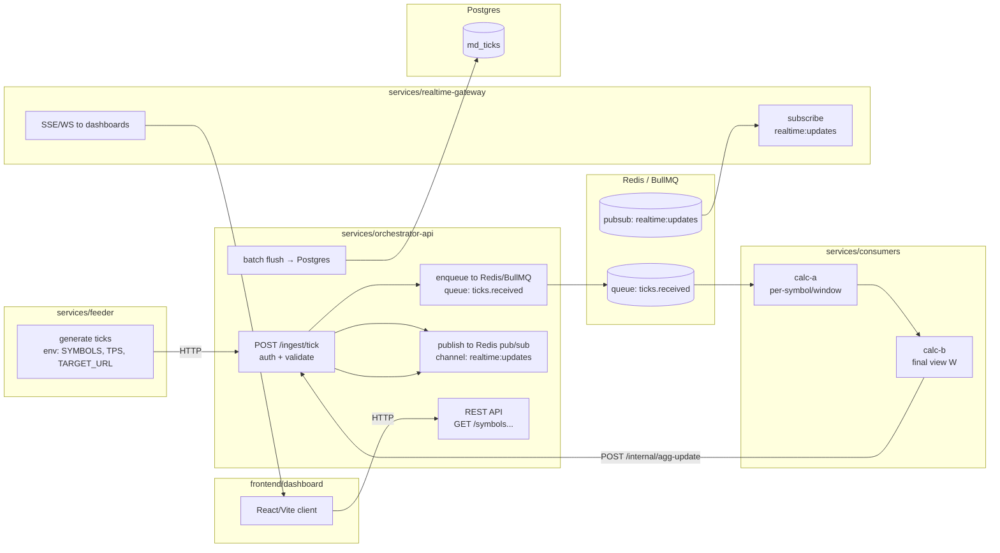
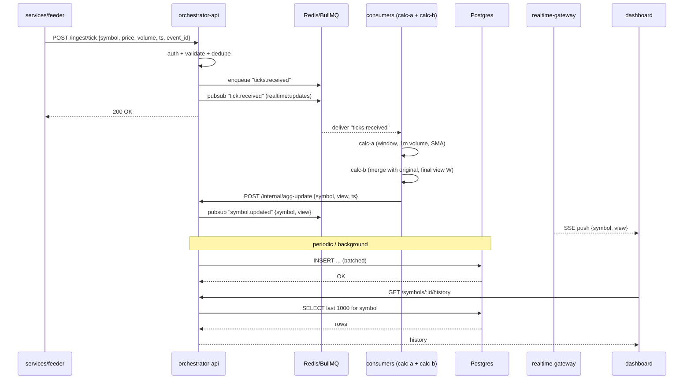

# System Design — Realtime Market Data Demo

[toc]

## 1. Functional Requirements (FR)

### FR-1 Ingest simulated market ticks
- Accept HTTP webhook calls from **services/feeder**.
- Tick payload:
  - `symbol` (string, e.g. "BTCUSDT", "XAUUSD")
  - `price` (number, > 0)
  - `volume` (number, >= 0)
  - `source` (string, simulated exchange/source id)
  - `ts` (ISO string or epoch ms)
  - `event_id` (string, unique per tick for idempotency)
- Webhook must be authenticated (Basic Auth): creds from env.
- Feeder is env-driven (symbols, TPS, target URL) and may run in a different environment.

### FR-2 Queue-first ingestion
- On receiving a tick, **services/orchestrator-api**:
  1. Authenticates & validates
  2. **Pushes tick to Redis/BullMQ** (queue name: `ticks.received`)
  3. Publishes a fast-path event to Redis pub/sub (`realtime:updates`) so dashboards can show instant change
  4. Returns 200 OK to feeder
- Rationale: we **do not** write every tick directly to Postgres to avoid crushing DB on write-heavy bursts.

### FR-3 Background processing (consumers)
- **services/consumers** reads from `ticks.received`.
- It includes **both** calc layers:
  - **calc-a**: per-symbol/per-window ops (e.g. last 10 ticks, 1m volume)
  - **calc-b**: combine output of calc-a with the original tick to produce final view `W`
- After computing, consumer calls **services/orchestrator-api**:
  - `POST /internal/agg-update` with `{ symbol, view, ts }` (internal endpoint)
- orchestrator-api then republishes to `realtime:updates`.

### FR-4 Serve dashboard APIs
- **services/orchestrator-api** exposes HTTP for frontend:
  - `GET /symbols` → list active symbols
  - `GET /symbols/:id` → latest aggregated view (`W`)
  - `GET /symbols/:id/history?limit=1000` → recent ticks
  - `GET /metrics`
  - `GET /health/liveness`, `GET /health/readiness`

### FR-5 Realtime updates (SSE/WS)
- **services/realtime-gateway** maintains SSE/WS connections.
- It **subscribes** to Redis pub/sub channel `realtime:updates`.
- On message, it pushes to all connected frontend clients.
- This keeps long-lived connections **out of** orchestrator-api.

### FR-6 Batch persistence
- orchestrator-api (or a tiny flusher worker in the same codebase) periodically:
  - reads buffered ticks
  - writes to Postgres in a single transaction
- This is the documented “may lose the last batch” behavior. (See `doc/storage-and-db.md`.)

### FR-7 Local + demo deployment
- All services dockerized.
- GitHub Actions = CI (lint, test, build, docker).
- Render = CD target for demo (each service as a Render service).
- K8s/Helm manifests stored under `/deploy/helm/**` for **future/prod**.

---

## 2. Non-Functional Requirements (NFR)

### NFR-1 Latency
- Ingest (feeder → API → Redis) and ACK: **≤ 150 ms** p95 inside the same region.
- Ingest → realtime-gateway → frontend: **≤ 1 s** p95.
- Ingest → Postgres (batch): **≤ 5 s** typical.

### NFR-2 Throughput (demo)
- 3–5 symbols
- 5–20 ticks/symbol/s → 15–100 tps total
- System must stay responsive at 100 tps because hot path is Redis.

### NFR-3 Durability (demo statement)
- Redis-first → Postgres-later.
- If the process dies before flush, **last batch can be lost**.
- This is acceptable for the demo; documented in the storage doc.

### NFR-4 Observability
- Every service exposes:
  - `/health/liveness`
  - `/health/readiness`
  - `/metrics` (Prometheus)
- Logs are structured JSON with `service`, `trace_id`/`event_id`.

### NFR-5 Security
- Webhook uses Basic Auth with env creds.
- Public APIs can use an `x-api-key` header (from env).
- No secrets committed.

### NFR-6 Delivery constraints
- Must be finishable in **8–10 hours**.
- Deep DB logic (GiST, advisory locks) is **documented** but **not implemented**.
- K8s/Helm manifests are present but **not** the primary deployment target.

---

## 3. Napkin Estimation

Assumptions:
- Symbols: 5
- Tick rate: 20 t/symbol/s → 100 tps
- Payload: ~200 B
- 100 tps → 8.6M ticks/day (stress), real demo will be far lower (10–20 tps total).

Why queue-first:
- 8.6M row inserts/day can overwhelm small Postgres.
- Batching 200 ticks every 2s → 43,200 tx/day → manageable.

Cost (order-of-magnitude):
- Render (4 small services + frontend): ~low tens USD
- Managed Postgres (small): ~15–30 USD
- Managed Redis (tiny): ~5–10 USD
- Fits prototype budget.

---

## 4. Technical Stack & Deployment

### 4.1 Stack
- **Backend**: Node.js 20 + TypeScript, Express
- **Queue**: Redis + BullMQ
- **DB**: Postgres (canonical store, history)
- **Frontend**: Vite + React + TS + React Query + Tailwind
- **Observability**: prom-client, JSON logs
- **CI**: GitHub Actions
- **CD**: Render (primary)
- **K8s/Helm**: `/deploy/helm/**` (reference / next phase)

### 4.2 Services
- `services/feeder`
- `services/orchestrator-api`
- `services/realtime-gateway`
- `services/consumers`
- `frontend/dashboard`
- `doc/*`

### 4.3 GitHub Actions (CI)
- On PR/push:
  - install (pnpm)
  - build
  - test
  - docker build
  - (optional) push to registry
- Render can auto-deploy from GitHub or from registry.

### 4.4 Render (CD)
- Each service is a separate Render service.
- Env vars:
  - `REDIS_URL`
  - `PG_URL`
  - `INGEST_USERNAME`
  - `INGEST_PASSWORD`
  - `API_KEY`
  - `QUEUE_NAME=ticks.received`
  - `PUBSUB_CHANNEL=realtime:updates`

---

## 5. Architecture Diagrams

### 5.1 Component / Service View

### 5.2 Tick Ingestion Lifecycle

---

## 6. Acceptance Criteria (v1)

1. Feeder can send ticks to the demo environment (Render).
2. orchestrator-api accepts, validates, enqueues, and publishes without touching Postgres.
3. Redis/BullMQ shows jobs under `ticks.received`.
4. consumers process jobs and call back `/internal/agg-update`.
5. orchestrator-api republishes updates to `realtime:updates`.
6. realtime-gateway fans out to at least 1 browser client via SSE.
7. Batch flush writes to Postgres and `/symbols/:id/history` returns data.
8. All services have `/health` and `/metrics`.
9. CI (GitHub Actions) runs build/test/docker.
10. Helm manifests exist but are clearly labeled **“next phase / production-only”**.

---

## 7. Related Docs

- `doc/storage-and-db.md` — why Redis-first, how batching to Postgres works, risk of data loss.
- `doc/architecture-scale.md` — K8s, HPA, splitting calc-a/b, GiST on ranges.
- `doc/services/*` — per-service details (to be added).
